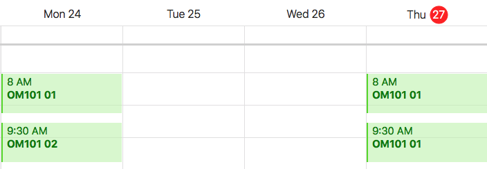
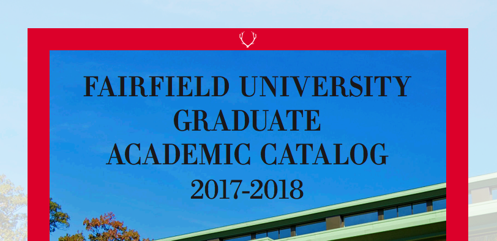
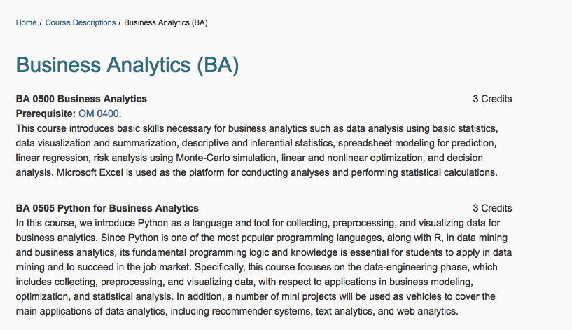
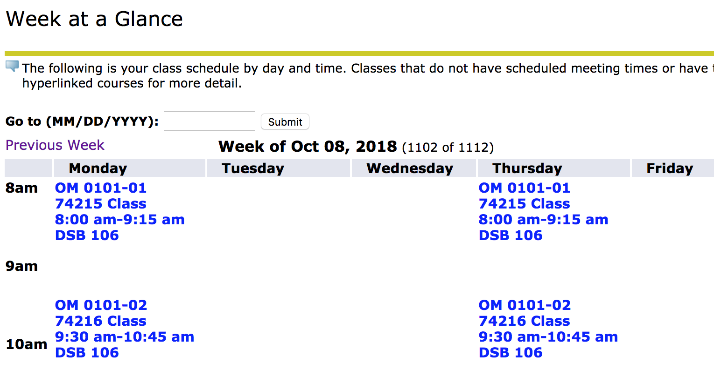
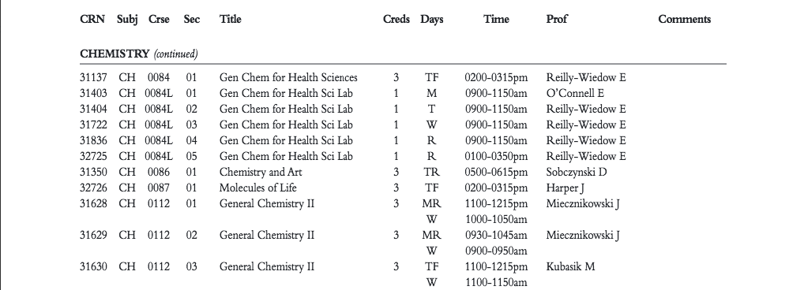
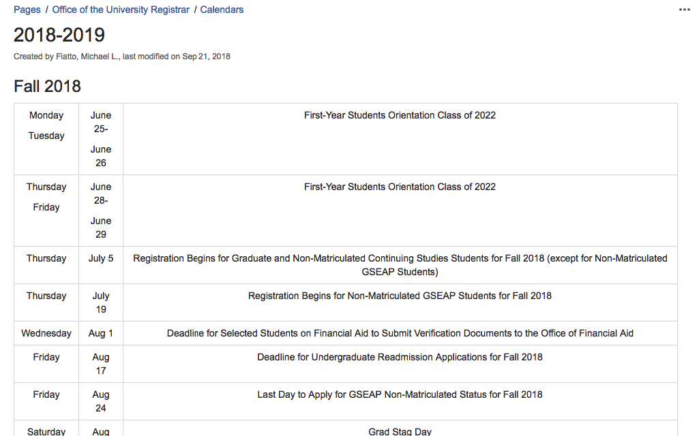

# Part 1: Setting the Stage 

## A Nasty Little Problem

When choosing a subject for this tutorial, lots of potential problem domains were considered but it did not take long to settle on the one thing every MS BA student could relate to: just how horribly difficult it is to get basic course schedule and curriculum information from the many, imperfect outlets provided by university staff and faculty. 

__Course calendars are an unfortunate fact of university life.__ Every course has one. However, they are often buried in MS Word-formatted syllabuses (in typewriter font or, worse, written out as paragraphs) or perhaps on a class website (as a table, if you're lucky), just like they were in 1996. 
  

   They are vitually never found as calendars in the modern sense, where events can be browsed, queried, and updated using a calendaring app.   
  
   
   While the details that one can include in a syllabus are great, they are just not very useful when you get a text message inviting you to dinner on, say, October 9. Is that a holiday -- Fall Break, right? -- or do we have class that night? Hold on while I pull out MS Word to check ... It should be right there on your phone, complete with the ability for us to embellish with reminders, notes, and attachments.
   
   __Almost as bad as course calendars are course catalogs, which are similarly unsearchable and incovenient.__ A printed 300 page book? A 350 page PDF that is impossible to read on my phone? Really?  

   If you can find any course details online it is usually just a course description with only vague information about course offerings.  
   
   
   Or, if it has information about course offerings then there is no course description. Ugh! Even the top-secret, you-gotta-have-a-password-to-see-it version from Banner is pretty cryptic and missing essential facts.
   
Heck, even Banner's week-by-week schedule data can't be trusted. The last I checked Monday, October 8 is for sure a holiday this year but of course we see this:

If we just restrict ourselves to publicly-available data, then we're mostly back to PDF files and Google searches. For undergrad courses it's especially bad, with the official *Schedule of Courses* published several months in advance in a PDF booklet that changes format slightly from year to year. 

   __So what about that October 9 class meeting again?__ Is that a holiday? I'd better consult the university "calendar" again. 

Oh, there it is ... scroll down to Fall break. It looks like Ocober 9 is a student holiday. Great! But why did it take looking in so many places to get this basic information? 

   No wonder everybody ends up in the grad programs office whenever they need to schedule their courses! The information is out there but in too many different places and in too many different forms and not 100% consistent with itself.  
   
   __There has to a better way to do this. Let's put on our data analyst hats and set a few goals.__
   1.  Make course descriptions and other data accessible in one, easily searchable place, so we can do further analysis.
   2. Normalize the data so that we can load the disparate data sources into fancy reports.
   3. Make course calendars available in iCal format for easy (and instant) import into any modern calendaring app. 
   4. Automate the entire data collection process, using original sources while minimizing unnecessary manual input. 
   
## Input Data and Output Data  
In the rant above we covered the following potential sources:
- A faculty-authored syllabus for a specific course. Getting access to this on anything other than a course-by-course basis is likely impossible.
- A course event calendar kept in the professor's preferred calendaring app. As with syllabuses, this is virtually impossible to get in bulk.
- An course catalog in PDF and web formats that does a decent job of describing each course but provides no calendaring information. These are both online and readily available to the public. However, there is no stable data interface, with precise formats and content subject to change at any moment. Even the URLs may change.  
- A printable PDF booklet with (possibly-outdated) undergraduate course offerings. 
- A course information management system (Banner) with data that is available to Faculty and Staff but not to students. We can, however, use some ninja tricks to export HTML reports from the system. We'll then have to scrape the logistical information we need for each course from the HTML.
- The official online Academic Calendar that lists essential events throughout the year but requires a bit of interpretation to use. For example, what does "[Tuesday] Classes Operate on a Monday Schedule – All Schools (except Graduate Nursing)" mean? Do Tuesday classes meet or not? 

__After lots of consideration, we will focus our explorations around the following data sources:__
 - The [PDF-formatted schedule booklet for undergraduate courses](201801CourseBooklet.pdf) (needed just in case a student needs a refresher before matriculating into the grad programs).
 - The [course catalog descriptions](http://catalog.fairfield.edu/courses/) on the university website.
 - A scraped [HTML copy of the Banner course enrollments report](Spring2018ClassSchedules.html). While not actually public, it is at least easily generated at the start of each semester. 
 - The [published Academic Calendar](AcademicCalendar2017_18.pdf), from which we can **manually** create scheduling rules for holidays and other exceptions to the published course schedules.

__We will then produce four outputs:__
- A CSV file with course descriptions and other catalog data
- A JSON-formatted course list with instructors, timecodes, and other logistical information
- A folder of ics (iCalendar) files, one per course, that can be imported into Google Calendar, Apple Calendar, etc. 
- A report on class enrollments, room utilizations, etc. 
    
## The Next Several Weeks
__The remainder of this tutorial will attack the problem in 6 parts, each focusing on a specific input and (possibly) an output or two.__
- Part 2: Working with Dirty PDF and CSV Files.
- Part 3: Creating a Web Spider with Scrapy.
- Part 4: HTML Scraping and JSON generation with Beautiful Soup.
- Part 5: Generating Output for the Masses. 
- Part 6: Data Analysis with Pandas & Matplotlib.

The remaining parts will be released as they become available over the next few weeks. You are not expected to code (much) but instead observe, learn, and apply what you know to your term project. 

